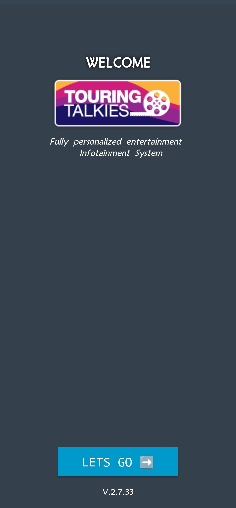
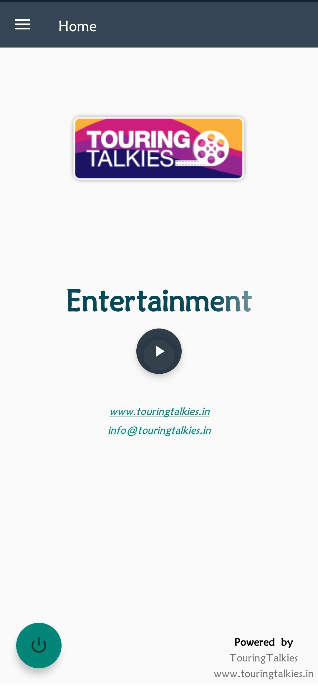
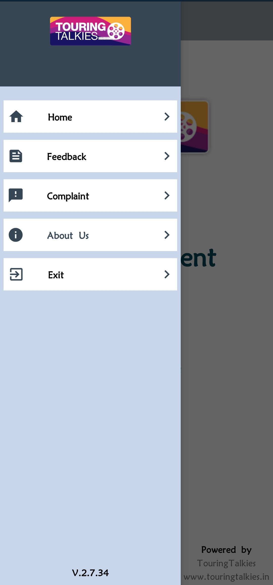
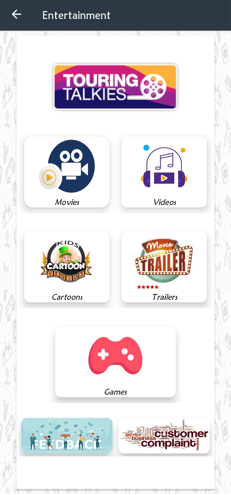
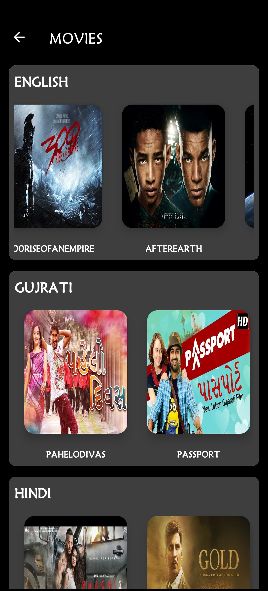
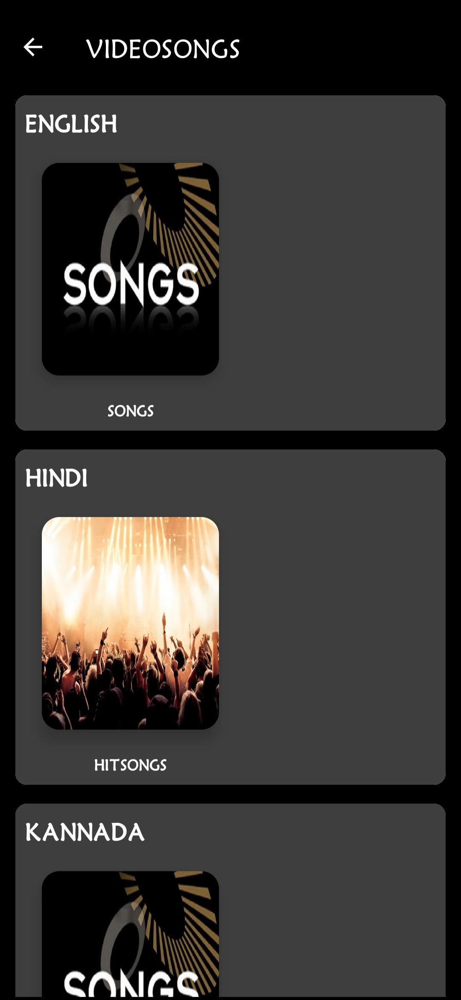
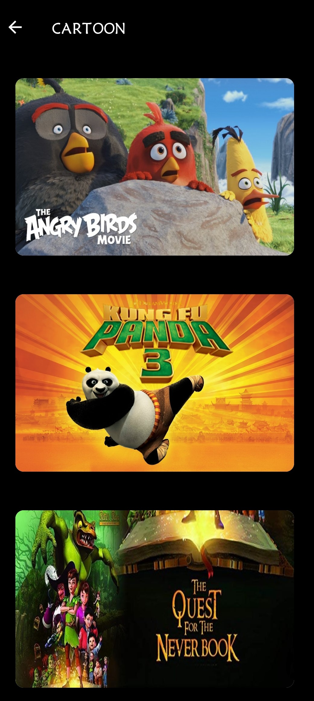

# 🎬 Touring Talkies

## 📌 Overview
**Touring Talkies** is a **B2C Offline OTT Application** designed specifically for mobile users traveling in buses. It enables passengers to watch movies, video songs, cartoons, and various entertainment content **without requiring internet access**, using a **local server setup (Raspberry Pi)** connected via Wi-Fi.

---

## 🛠️ Project History
- Originally developed in **2017** using **Java**.
- From **2023 onward**, I took over development and modernization:
  - Introduced **Kotlin** support alongside Java.
  - Migrated older legacy logic to **MVVM architecture**.
  - Updated libraries to support **latest Android versions**.
  - Replaced deprecated components and optimized app performance.

---

## 🚀 Key Features

- **Offline Streaming with Local Server**  
  Connects to a local Raspberry Pi server over Wi-Fi to stream content without needing the internet.

- **Smart Connectivity Check**  
  After splash screen, app verifies Wi-Fi and server availability before proceeding.

- **Custom Intro Video**  
  Plays a short operator-branded intro video before landing on the home page.

- **Home Page Features**  
  Displays operator logo, website, contact details, and navigation.

- **Category-based Entertainment Access**  
  Content is organized into categories (Movies, Videos, Cartoons, Comedy, Sports, Games), further filtered by language and sub-category.

- **Resume Playback Support**  
  Prompts the user to resume where they left off when re-watching a movie.

- **Ad Integration**  
  Ads are played between video content to enhance engagement and monetization.

- **Holiday Wishes & Feedback Flow**  
  - Displays greetings on holidays before playback.
  - Shows a feedback/complaint dialog post-viewing to improve travel experience.

- **User Behavior Tracking**  
  Records content preferences for analytics, helping operators enhance future content.

---

## 🔧 My Contributions

- ✅ Migrated the project from Java-only to **Java + Kotlin** hybrid.
- ✅ Replaced old data structures with **Room Database** for scalable local storage.
- ✅ Refactored architecture to follow **MVVM pattern** for better separation of concerns.
- ✅ Used **coroutines** in place of Java threads for efficient asynchronous tasks.
- ✅ Integrated **Media3 library** for enhanced video playback and ad handling.
- ✅ Revamped UI for movie and video listings using **Material 3** design principles.
- ✅ Added intro video, feedback dialog, and server verification workflows.
- ✅ Integrated **Firebase Crashlytics** for crash monitoring.

---

## 🧱 Tech Stack

| Category            | Technology Used                             |
|---------------------|---------------------------------------------|
| Programming         | Java, Kotlin                                |
| UI Design           | XML, Material 3                             |
| Architecture        | MVVM                                        |
| Networking          | Retrofit2                                   |
| Video Playback      | Media3 Library                              |
| Database            | Room Database                               |
| Crash Reporting     | Firebase Crashlytics                        |
| Async Tasks         | Kotlin Coroutines                           |
| Custom Components   | Fragment Dialogs for wishes and feedback    |

---

## 📸 Screenshots

<!-- Row 1: 3 images -->

  
  
  
  

<!-- Row 2: 2 images -->

  
  
  

---

## 📈 Outcome & Impact

- ✅ Optimized for modern Android versions and device compatibility.
- ✅ Enhanced user experience for passengers with personalized entertainment.
- ✅ Enabled operators to collect real-time insights for business improvement.
- ✅ Provided an **internet-free OTT experience** tailored to the travel industry.
